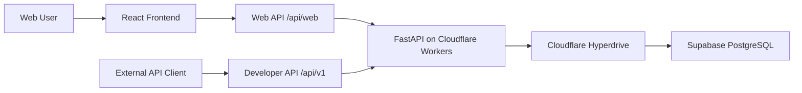

# Luxury Watch Price Data API Integration

- The frontend supports filtering by brand, model, price, and year.
- The backend is built with FastAPI and runs on Cloudflare Workers.
- Market data is stored in a Supabase PostgreSQL database.
- Cloudflare Hyperdrive is used between the Worker and PostgreSQL.
- The project includes an authenticated REST API with API key access and rate limiting.
- `luxury_watch_api_client.ipynb` shows how an external user can connect to the live API and retrieve data.
- The project demonstrates API design, backend integration, database access, security, and production deployment.
- Live site: https://watches.dcanguven.com

## Architecture

## Tech Stack

